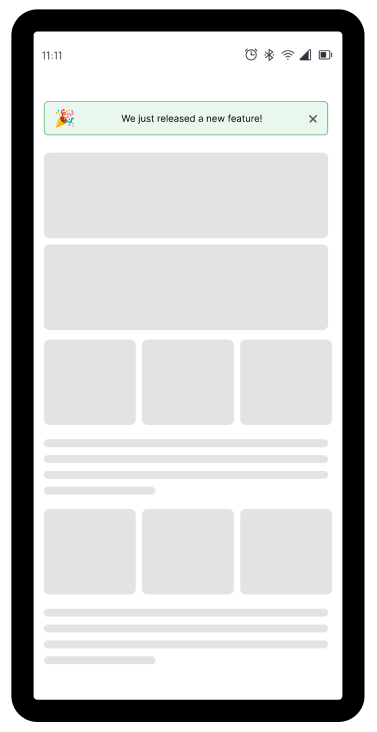
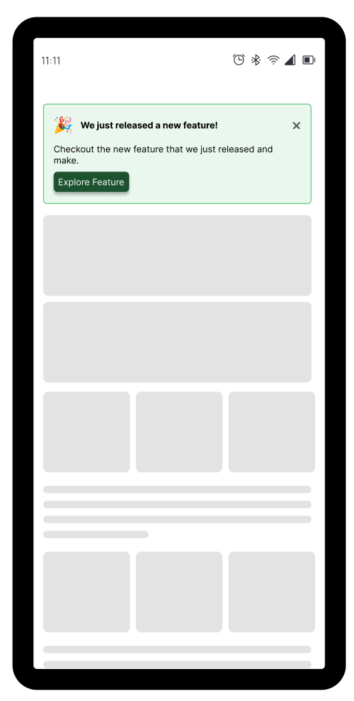
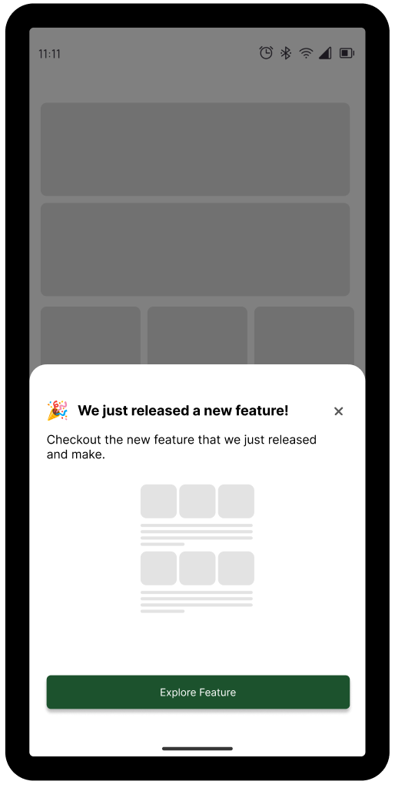
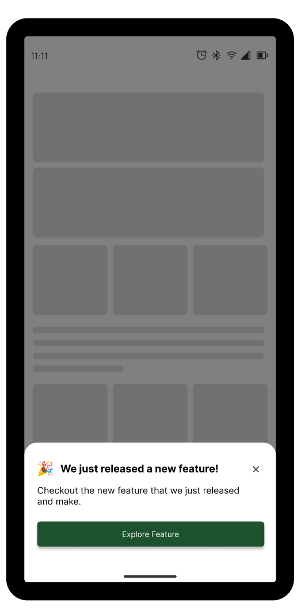

# Feature Notifier

Notify your users of new features within your app after an update.

#### What this package offers?

- Display details about new features
- Users will never be notified after closing the feature notifier.
- Create your custom Notifiers by accessing methods that let you persist and change display/state based on user interactions.

#### Example Gallery






##### Usage

Add it to your package’s pubspec.yaml file

```dart
feature_notifier: latest
```

import if into your code

```dart
import 'package:feature_notifier/feature_notifier.dart';
```

##### Initialize

Initialize and `await` feature notifier in your `main(){}` function by calling `featureNotifierInit()`. Not doing this can cause side effects that might tamper with expected behaviour.

```dart
void main() async {
  await featureNotifierInit();
  runApp(const MyApp());
}
```

## Feature Notifiers

There are currently 4 unique and highly customizable feature notifiers in this package with slightly different implementations.

#### 1. Bar Notifier


Returns a simple and customizable horizontal bar.

```dart
FeatureBarNotifier(
  title: "We just released a new feature!",
  featureKey: 2,
  onClose: () {},
  onTapCard: () {},
  showIcon: true,
)
```

#### 2. Card Notifier


Returns a simple and customizable Card

```dart
FeatureCardNotifier(
  title: "We just released a new feature!",
  featureKey: 2,
  onClose: () {},
  onTapCard: () {},
  showIcon: true,
  //use the hasButton parameter to display a button
  hasButton:true,
)
```

#### 3. Alert Dialog Notifier


Returns a simple and customizable alert dialog.

```dart
FeatureAlertNotifier.notify(
  context,
  title: "Alert Dialog",
  description: "Alert dialog is a good way to display a feature",
  onClose: () {},
  featureKey: 3,
  hasButton: true,
);
```

A common use-case for the alert notifier to be shown is when a screen has completed it build and marked has built. Hence, you will need to access the `WidgetsBinding.instance.addPostFrameCallback()` callback method within the `initState` of your stateful widget to evoke the `notify()` method of the FeatureAlertNotifier.

```dart
void initState() {
  super.initState();
  WidgetsBinding.instance.addPostFrameCallback((_) {
    print("Build Completed");
    FeatureAlertNotifier.notify(
      context,
      title: "Alert Notifier,
      description: "Modal sheet is a good way to display a feature",
      onClose: () {},
      featureKey: 3,
      hasButton: true,
    );
  });
}

```

#### 4. Bottom Modal Sheet Notifier



Returns a simple and customizable horizontal bar.

```dart
FeatureBottomModalSheetNotifier.notify(
  context,
  title: "Modal sheet example",
  description: "Modal sheet is a good way to display a feature",
  onClose: () {},
  featureKey: 3,
  hasButton: true,
```
