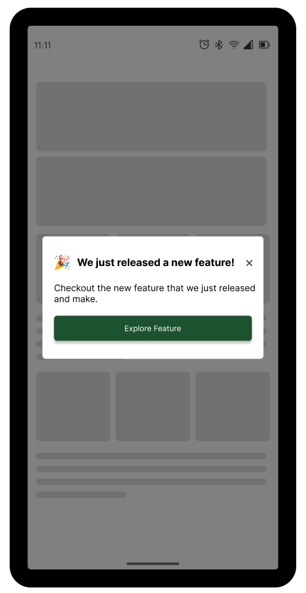

# Feature Notifier

Notify your users of new features within your app after an update.

#### What this package offers?

- Display details about new features
- Users will never be notified after closing the feature notifier.
- Create your custom Notifiers by accessing methods that let you persist and change display/state based on user interactions.

#### Example Gallery





##### Usage

Add it to your package’s pubspec.yaml file

```dart
feature_notifier: latest
```

import if into your code

```dart
import 'package:feature_notifier/feature_notifier.dart';
```

##### Initialize

Initialize and `await` feature notifier in your `main(){}` function by calling `featureNotifierInit()`. Not doing this can cause side effects that might tamper with expected behaviour.

```dart
void main() async {
  await featureNotifierInit();
  runApp(const MyApp());
}
```

## Feature Notifiers

There are currently 4 unique and highly customizable feature notifiers in this package with slightly different implementations.

#### 1. Bar Notifier

```dart
FeatureBarNotifier(
  title: "Testing this out You have pushed the button this many times:",
  featureKey: 2,
  onClose: () {},
  onTapCard: () {},
  showIcon: true,
  // icon: Text("dog"),
)
```
